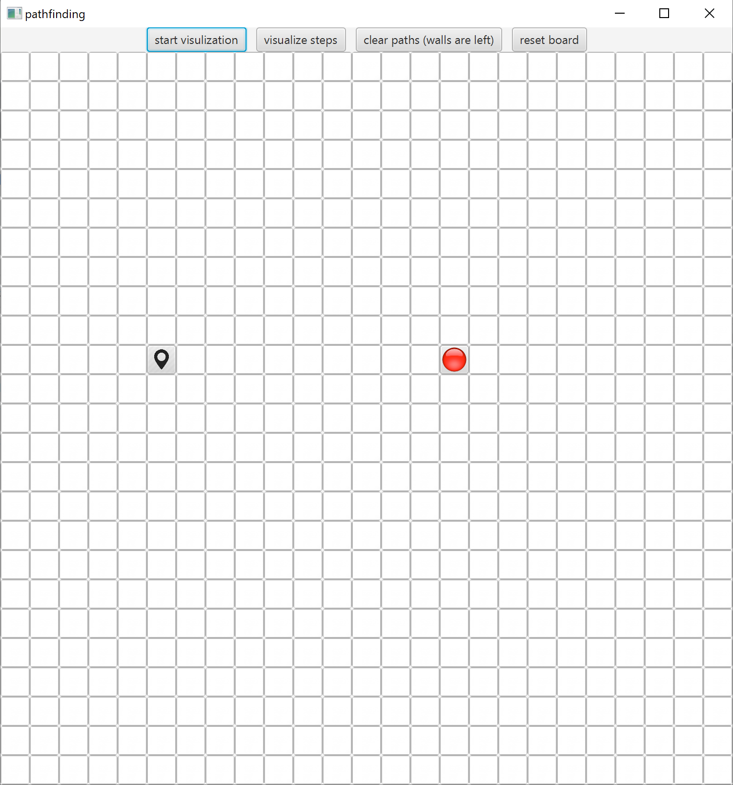
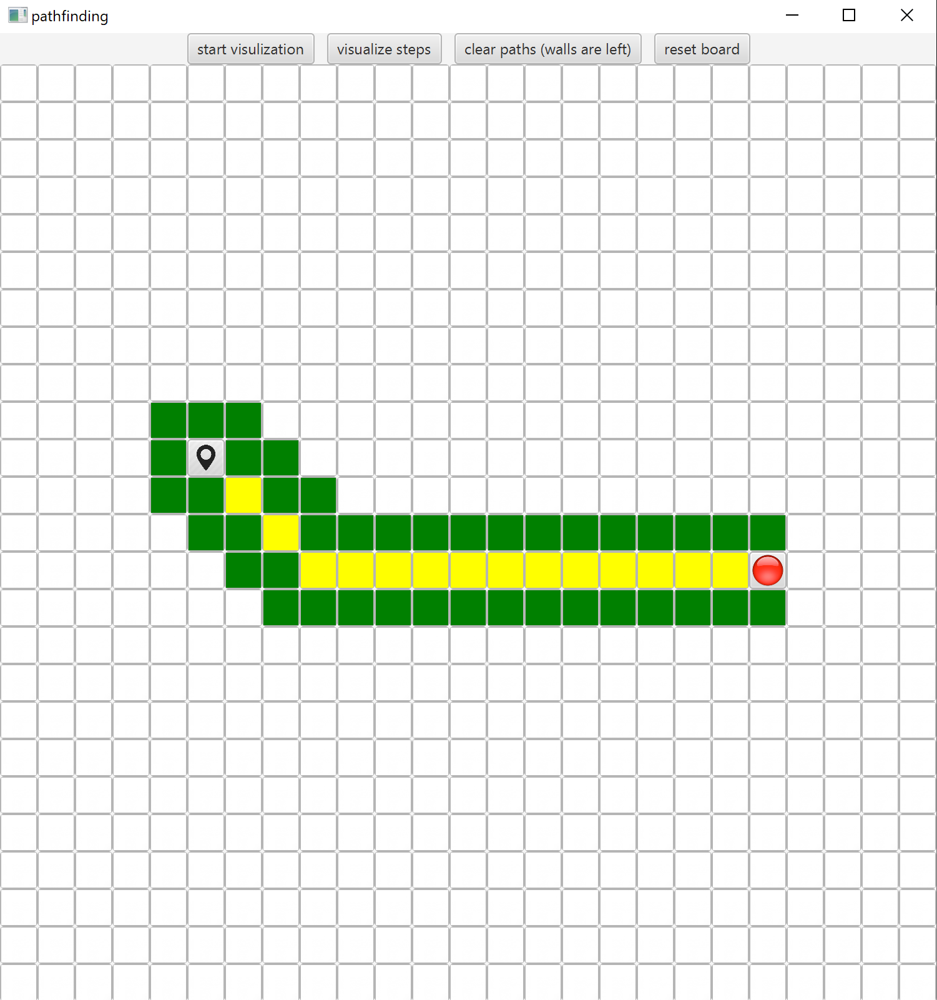
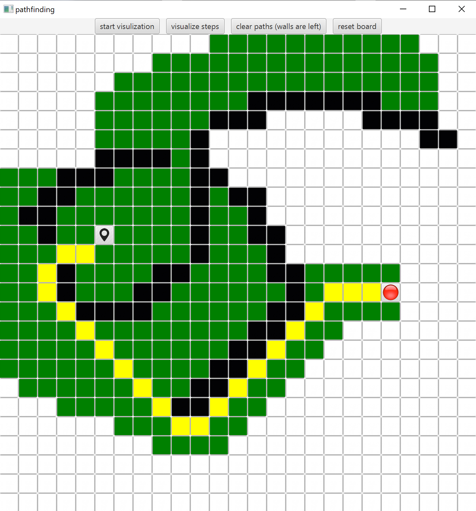

# pathfinding
A visualization of the A* path finding algorithm

Upon starting the user will be given a board with a start node and a red end node. 

At this point the user can chose to move either of the nodes or press the start visualization button or the visuzalize steps button 
to begin the visualization of the algorithm. The nodes that are checked by the algorithm are highlighted in green and the final shortest path is highlighted in yellow.

After the visualization has been run the user can chose to either clear the entire board including the walls
or just clear the path so it can be visualized again using the reset board button and the clear paths button respectively. Wall nodes (shown in black) are impassable by the algorithm and can be drawn by clicking on nodes or by clicking and dragging the mouse. Walls are removed by clicking on the wall nodes or by clicking and dragging over them.

